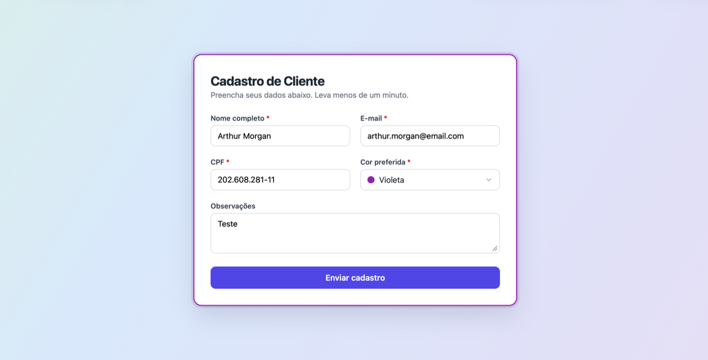
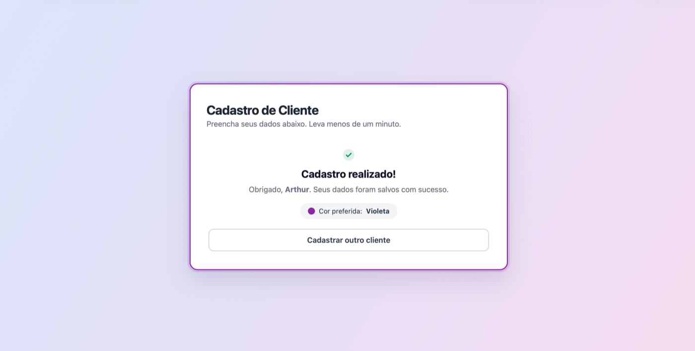

# Customer Registration App

Formulário público de cadastro de clientes — nome completo, CPF, e-mail, cor
preferida (arco-íris) e observações — em Node.js, TypeScript, React e
PostgreSQL.

A análise de requisitos e as decisões de projeto (por que a unicidade é por
CPF, por que as cores vêm do banco, etc.) estão em [`docs/SPEC.md`](docs/SPEC.md).

## Deploy

- **App**: https://customer-registration-web.vercel.app
- **API**: https://customer-registration-api-ze3r.onrender.com (`/docs` para a documentação interativa)

Frontend no Vercel, API no Render (plano free — o serviço "dorme" após
inatividade e o primeiro request pode demorar ~30s para acordar), banco
Postgres na Neon (via Vercel Marketplace). Deploy automático a cada push na
`main`.

### Prints

| Formulário | Cadastro concluído |
|---|---|
|  |  |

## Stack

| Camada   | Tecnologias |
|----------|-------------|
| Frontend | React 18, TypeScript, Vite |
| Backend  | Node.js, TypeScript, Express, Zod |
| Banco    | PostgreSQL, Prisma ORM (migrations versionadas) |
| Infra    | Docker + Docker Compose |
| Testes   | Vitest |

## Estrutura

```
.
├── docs/SPEC.md          # Requisitos e decisões de projeto
├── server/                # API
│   ├── prisma/            # Schema e migrations
│   └── src/
├── web/                   # Frontend
│   └── src/
└── docker-compose.yml     # API + banco + frontend
```

## Rodando com Docker

```bash
cp .env.example .env
docker compose up --build
```

Sobe três serviços: `db` (Postgres 16, volume persistente), `api` (aplica as
migrations ao iniciar, `http://localhost:3333`) e `web` (build estático
servido via Nginx, `http://localhost:5173`).

Na primeira vez, popule as cores:

```bash
docker compose exec api npm run prisma:seed
```

## Rodando localmente (sem Docker)

Requer Node.js 20+ e um PostgreSQL acessível.

```bash
# backend
cd server
cp .env.example .env      # ajuste DATABASE_URL se necessário
npm install
npm run prisma:migrate:dev
npm run prisma:seed
npm run dev                # http://localhost:3333

# frontend, em outro terminal
cd web
cp .env.example .env
npm install
npm run dev                 # http://localhost:5173
```

## Testes e lint

```bash
cd server
npm test    # Vitest — validação de CPF e do schema de cadastro
npm run lint

cd ../web
npm run lint
```

## API

A especificação completa (rotas, payloads, exemplos, códigos de erro) é
servida pela própria API, gerada a partir do código — é sempre a versão
atual:

- Swagger UI: `http://localhost:3333/docs`
- OpenAPI JSON: `http://localhost:3333/openapi.json`

Resumo das rotas:

| Método | Rota | Descrição |
|--------|------|-----------|
| GET | `/health` | Healthcheck |
| GET | `/api/colors` | Cores disponíveis para o formulário |
| GET | `/api/clients` | Lista os cadastros (mais recentes primeiro) |
| POST | `/api/clients` | Cria um cadastro (`409` se CPF/e-mail já existir) |

`GET /api/clients` não tem autenticação nesta versão — o teste não pediu
área administrativa, então essa rota fica sem proteção além do rate limit.
Não deve ir para produção exposta assim sem autenticação.

## Segurança do formulário público

Sem exigir login de quem preenche, o `POST /api/clients` tem duas camadas
contra abuso:

- **Rate limiting por IP**: 5 tentativas de cadastro a cada 15 minutos
  (`GET /api/clients`, 30/15min). Estourar o limite retorna `429`.
- **Honeypot**: o formulário manda um campo `website`, invisível para gente
  de verdade (fora da ordem de tabulação, escondido via CSS, não via
  `display: none` — isso engana bots com mais frequência). Se vier
  preenchido, a API responde `201` normalmente mas não grava nada — assim o
  bot não aprende a evitar o campo.

Nenhuma das duas exige CAPTCHA nem atrapalha quem está preenchendo de
verdade.

## Decisões de projeto (resumo)

- **Cores como dado, não constante do frontend** — o cliente avisou que a
  lista pode mudar; troca de cor não pede novo deploy do front.
- **Unicidade por CPF/e-mail** para garantir "um cadastro por cliente" sem
  exigir login.
- **Migrations do Prisma versionadas** para outra equipe reproduzir o banco
  com um comando (`prisma migrate deploy`).

Racional completo em [`docs/SPEC.md`](docs/SPEC.md).

## Próximos passos

Fora do escopo deste entregável, mas próximo natural do projeto:

- Painel administrativo para consultar os cadastros (e autenticação nele).
- Confirmação por e-mail do cadastro.
- CI (lint + testes) no pipeline de deploy.
